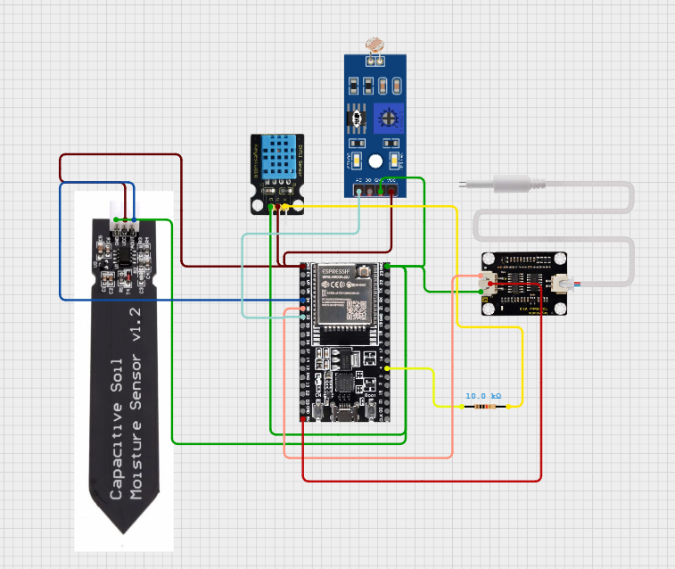

# 🌱 Agrixa


## 📖 Project Overview

**Agrixa** is a smart agriculture monitoring system developed as part of our **first-year multidisciplinary project**.  
The platform helps farmers monitor environmental conditions affecting crop growth and provides intelligent insights to improve crop health and yield.

The system collects real-time data from sensors measuring **temperature, humidity, soil moisture, light intensity, and nutrient levels** using an **ESP32 microcontroller**.

The sensor data is transmitted to **Firebase**, which acts as a **real-time cloud database**, allowing our website to instantly retrieve and analyze the environmental conditions.

Using this data, Agrixa can:

- Evaluate whether environmental conditions are suitable for crop growth
- Estimate **plant growth rate**
- Provide **crop recommendations**
- Detect **plant diseases using AI models**

This integration of **IoT, cloud databases, and machine learning** enables farmers to make more informed agricultural decisions.

---

# 🚀 Features

## 🌾 Crop Monitoring
Analyzes incoming sensor data to provide a real-time overview of:

- Temperature
- Humidity
- Soil moisture
- Light exposure
- Nutrient levels

The system uses this data to determine if the crop is receiving **optimal environmental conditions** and calculates an estimated **plant growth rate**.


## 🌱 Crop Recommendation
Based on the environmental metrics collected from sensors, Agrixa suggests **other crops that can grow successfully in the same environment**, helping farmers optimize land usage.


## 🦠 Plant Disease Detection

Farmers can upload crop images to detect diseases using trained **machine learning models**.

Currently supported crops:

- **Sugar Cane**
- **Rice**
- **Wheat**

The system not only predicts the disease but also **suggests solutions and treatment methods**.

> **Note:**  
> - Crop disease models were sourced from **Kaggle datasets**  
> - Weather condition data is retrieved from **Open-Meteo API**

<br>


# 💠 System Architecture

```
Sensors
   ↓
ESP32 Microcontroller
   ↓
Firebase Realtime Database
   ↓
Backend (Python Server)
   ↓
Web Dashboard (React + Vite)
   ↓
AI Disease Detection Models
```


### Workflow

1. Sensors collect environmental data
2. ESP32 reads the sensor values
3. Data is uploaded to **Firebase Realtime Database**
4. The website retrieves data from Firebase
5. Backend processes the data
6. AI models analyze uploaded crop images for disease detection
7. Results are displayed on the website dashboard

<br>

---

# 🔌 Hardware Setup

Below is the circuit diagram illustrating the sensor connections.



### Components Used

- Capacitive Soil Moisture Sensor
- DHT11 Temperature and Humidity Sensor
- LDR Sensor Module (Light Sensor)
- Analog TDS Water Conductivity Sensor
- ESP32 DevKit V1
- 10 kΩ Resistor

**The code for the ESP32 can be found in the `eps32_code.ino` file.**

The **ESP32 collects sensor readings and sends them to Firebase**, enabling real-time data monitoring through the web application.

---

# 👥 Team Members

- [Ethan Devadatta](https://github.com/EthanDevadatta) 
- [Guru Chith](https://github.com/W2Lguru)
- [Dani](https://github.com/dnvdevx)
- [Aadityaa Elango](https://github.com/Aadhityaa-HUB)
- [Joshua Titus](https://github.com/joshuatitus07)

---

# ⚙️ Installation & Setup

Follow the steps below to run the project locally.


## 1️⃣ Clone the Repository

```bash
git clone <repository-url>
cd Agrixa
```
--- 
## 2️⃣ Frontend Setup

Install dependencies and start the Vite development server.

```bash
npm install
npm run dev
```

The frontend will start at: 
```bash
http://localhost:5173
```
---
## 3️⃣ Backend Setup

Navigate to the backend folder and start the Python server.
```bash
cd backend
pip install -r requirements.txt
python run_server.py
```
The backend server will run at:
```bash
127.0.0.1:8000
```

---
## 4️⃣ Environment Variables

Create a `.env` file in the project root.
```bash
cp .env.example .env
```
Update the `.env` file with the required configuration values.

---
## 📊 Technologies Used
### Hardware

- ESP32

- IoT Sensors

### Frontend

- React

- Vite

### Backend

- Python    

### Cloud & APIs

- Firebase (Realtime Database)

- Open-Meteo Weather API

### Machine Learning

- Crop Disease Detection Models (Kaggle)

---
## 📜 License


```
This project was created for educational purposes as part of a university multidisciplinary project.
```